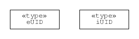

.. _serialisation:

======================================================
Some comments about serialisation of uncertain numbers
======================================================

.. contents::
   :local:

Overview
========
``GTC`` implements the method of evaluating measurement uncertainty described in the GUM [#GUM]_. The idea is that a mathematical description of the measurand is given as a function of the factors that can significantly influence the outcome of a measurement procedure. This is called a measurement model (see :ref:`measurement_models`)

.. math::

    Y = f(X_1, X_2, \cdots) \;,
    
where the :math:`X_i` are influence quantities. 

A function :math:`f(\cdots)` that describes one measurement process at a particular laboratory is often used. However, this is not strictly correct. A traceable measurement is actually a staged process that takes place over time and at different laboratories. Typically, national metrology institutes realise SI unit standards and then calibrate transfer standards for second-tier calibration laboratories. The second-tier laboratories in turn calibrate customer instruments, or other working standards, until the process finally ends with a measurement that is not passed further along the chain. 

The function :math:`f(\cdots)` should really describe the whole traceability chain up to the current stage, starting with the realisation of physical unit references! In practice, no one does that yet; however, the serialisation processes provided by ``GTC`` does implement the necessary data handling. Using serialisation, it is possible to capture the details about influences from one session and store them. When those details are restored during a later session, the ``GTC`` calculation can be continued with no loss of information.

This section of the documentation describes the conceptual model we use to think about storing and retrieving uncertain numbers. The description does not depend on a particular serialisation format (like JSON or XML). We use UML diagrams to illustrate the model [#UML]_.

.. _serialisation_elements:

Basic Structual Elements 
========================
The :math:`X_i` terms in the measurement function refer to influence quantities; they are not precisely known. We may think of them as being the difference between :math:`x_i`, an estimate, and :math:`E_i` the estimate error (unknown). So, :math:`X_i = x_i - E_i`, where the estimate of :math:`E_i` is zero with some uncertainty :math:`u_i`, and perhaps some degrees of freedom, :math:`\nu_i`.

When we supply values for :math:`x_i`, :math:`u_i`, and :math:`\nu_i` (e.g., using :func:`~core.ureal`), we call the resulting uncertain number object an *elementary* uncertain number. We need to be aware of this for serialisation, because the individual properties of elementary uncertain numbers do no depend on other uncertain numbers (they may be correlated with other elementary uncertain numbers, but that is a property of uncertain-numbers pairs).

When an uncertain number object is created by a calculation involving other uncertain numbers we call it an *intermediate* uncertain number. Intermediate uncertain numbers are created explicitly by using :func:`~core.result`.

The objective of serialisation is to store selected elementary and intermediate uncertain numbers so that they can be restored to a different Python session and used there without loss of information. The :class:`~persistence.Archive` class is used to marshal selected uncertain numbers and prepare them for storage, or to extract selected uncertain numbers after retrieval from storage. The conceptual processes involved are described in this section, starting with the most basic data types involved.

Basic types
-----------
The range of values that some of the primitive data types can take is constrained in our descriptions. Degrees of freedom (``DoF``) is a real number that must be greater than or equal to unity (and may be explicitly set to infinity). Standard uncertainty (``Uncertainty``) is a real number that must be greater than or equal to zero. A correlation coefficient (``CorrelationCoef``) is a real number greater than or equal to -1 and less than or equal to 1. 

.. figure:: ../images/dm/special_primitives.png
    :align: center
    :alt: Constrained primitive data types
    
    Classes for degrees of freedom, standard uncertainty, and correlation coefficient.

One of the most important details for digitalisation of the GUM process is the mechanism used to represent the subscripts appearing in GUM formulae. The GUM notation is intended for people familiar with mathematical notation. It appears quite simple, but the innocent looking subscript :math:`i` must uniquely identify each object. We need identifiers that are unique, not just in a particular session but in any future session too: we need what is called a Universally Unique Identifier. Serialisation uses two identifier formats, both resulting in unique identifiers. One format is used for elementary uncertain numbers, the other for intermediate uncertain numbers. We refer to these identifiers as ``eUID`` for elementary uncertain numbers and ``iUID`` for intermediate uncertain numbers. 

    
    Unique identifier classes for elementary and intermediate uncertain numbers

A few classes pair an ID with a value for data. These classes are tagging the data with an identifier, just as we use a subscript in formal notation.

.. figure:: ../images/dm/id_reals.png
    :align: center
    :alt: Pairing of IDs with real values
    
    Pairing of unique identifiers for elementary and intermediate uncertain numbers with data.

A few more classes are associated with ``eUID``. 

    * ``Ensemble`` is a collection of elementary uncertain-number IDs that belong to the same ensemble (the collection may be considered a set, where order is not important and each element is unique).   

    .. figure:: ../images/dm/ensemble.png
        :align: center
        :alt: Ensemble class
        
        An ensemble is a set of IDs for elementary uncertain numbers. 
        
    * ``Correlation`` is a collection of elementary uncertain-number IDs that have been assigned correlation coefficients. 

    .. figure:: ../images/dm/correlation.png
        :align: center
        :alt: Correlation class
        
        A set of IDs for elementary uncertain numbers that have assigned correlation coefficients. 
 
    * ``ComplexLeaf`` consists of a pair of ``eUID`` values. This is sufficient to reconstitute an elementary complex uncertain number.

    .. figure:: ../images/dm/complex_leaf.png
        :align: center
        :alt: ComplexLeaf class
        
        An elementary complex uncertain number is really a pair of elementary real uncertain numbers. 

Nodes
-----
The information required to restore an influence quantity is captured by ``LeafNode``. There are a number of optional attributes.

    * ``label`` may not have been assigned
    * ``complex`` is needed when the node is one component of an uncertain complex number.
    * `` correlation`` will be needed when correlation coefficients have been assigned (e.g., using :func:`~core.set_correlation`)
    * ``ensemble`` will be needed when the elementary uncertain number is part of an ensemble

    
    The ``LeafNode`` holds all information needed about an influence quantity. 

The corresponding ``ComplexLeaf`` just contains the pair of identifiers for the elementary uncertain numbers that represent the real and imaginary components

    
    The ``ComplexLeaf`` holds a pair of identifiers for the real and imaginary components. 

There is also an ``IntermediateNode`` that holds information about a result. This supplements information that is available in another class called ``IntermediateReal``.

.. figure:: ../images/dm/intermediate_node.png
    :align: center
    :alt: IntermediateNode class
    
    The ``IntermediateNode`` holds information about a result. This is not needed for uncertainty propagation, but it is required to restore an intermediate uncertain number in a session. 

.. note:: 

    Uncertain-number identifier formats do affect the conceptual description of serialisation; however, ``GTC`` relies on certain format details. Integer tuples as identifiers of uncertain-number objects. For elementary uncertain numbers, the identifier is a 2-tuple: the first element is a UUID, in long integer format, obtained once for each session; the second element is an integer obtained from a counter which is incremented during the session. This format of elementary uncertain number identifier can be ordered. For intermediate uncertain numbers, the identifier is a 3-tuple, with the first two elements obtained as for elementary uncertain numbers and the last element is zero. The length of the tuple distinguishes betwen elementary and intermediate identifiers, so first two elements of each may collide.

.. rubric:: Footnotes
 
.. [#GUM]

    BIPM and IEC and IFCC and ISO and IUPAC and IUPAP and OIML, 
    *Evaluation of measurement data - Guide to the expression of uncertainty in measurement JCGM 100:2008 (GUM 1995 with minor corrections)*, (2008) `http://www.bipm.org/en/publications/guides/gum <http://www.iso.org/sites/JCGM/GUM/JCGM100/C045315e-html/C045315e.html?csnumber=50461>`_

 
.. [#UML] 

   Object Management Group, *Unified Modeling Language Specification (Version 2.5)*, (2015) https://www.omg.org/spec/UML/2.5
