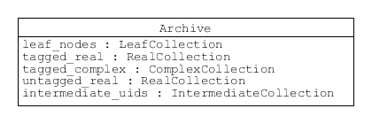
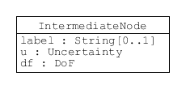

.. _serialisation:

==================================
Serialisation of uncertain numbers
==================================
This section of the GTC documentation describes our way of storing and retrieving uncertain numbers. The description does not depend on a particular format (like JSON or XML). We use UML diagrams to illustrate the ideas [#UML]_.

.. contents::
   :local:

The measurement model
=====================

GTC implements the method of evaluating measurement uncertainty described in the GUM [#GUM]_. This is the idea that a mathematical model of the measurand can be expressed as a function of terms representing quantities that significantly influence the outcome of a measurement procedure. This function can also be called the measurement model (see :ref:`measurement_models`),

.. math::

    Y = f(X_1, X_2, \cdots) \;,
    
where the :math:`X_i` are influence quantities, which are not precisely known. What is known are values for influence quantity estimates, :math:`x_i`. The standard uncertainty in :math:`x_i` as an estimate of :math:`X_i` is denoted :math:`u(x_i)`. A value for the degrees of freedom, :math:`\nu_i`, may also be available [#UREAL]_.

A particular measurement process at a laboratory is often taken to be the subject being modelled. However, this is not strictly correct. A traceable measurement is really a staged process that takes place over time and at different laboratories. Typically, national metrology institutes realise reference standards for SI units and then calibrate transfer standards for second-tier calibration laboratories. Second-tier laboratories in turn calibrate customer instruments, or other working standards. This process finally ends with a measurement that is not passed further along the chain. 

The function :math:`f(\cdots)` should really describe the whole traceability chain, starting with the realisation of unit references and continuing to the current stage. In practice, no one does that; however, the serialisation processes provided by GTC implements the necessary data processing. 

Serialisation makes it possible to store uncertain-number results and their influences defined in one session. Those details can be restored in a later session, where calculations can be continued with no loss of information. So, serialisation allows data processing to be staged. This is helpful to account for consecutive stages in a traceability chain.

Components of uncertainty 
-------------------------

The GUM explains that it is important to report the value of a measurement result together with as much information about its uncertainty as possible. In particular, the set of uncertainty components are important and should be reported (these values are often called an uncertainty budget). The components are defined as

.. math::

    u_i(y) = \left. \frac{\partial f}{\partial X_i} \right|_{X_i = x_i} \, u(x_i)\;,

where :math:`u(x_i)` is the standard uncertainty in :math:`x_i` as an estimate of :math:`X_i`, and :math:`u_i(y)` is the GUM notation for a component of uncertainty in the result :math:`y` due to uncertainty in the influence estimate :math:`x_i`.

The standard uncertainty in :math:`y`, as an estimate of :math:`Y`, can be calculated from a complete set of uncertainty components.

The GTC algorithms for uncertainty propagation use the uncertainty components held in uncertain number objects. So, serialisation must capture these components.

Serialisation
=============

The goal of serialisation is to store enough detail about the uncertain numbers selected for storage to allow them to be restored in a different Python session and used there without loss of information.
 
We focus here on what we call marshalling the uncertain-number data, which involves preparation of data for storage (serialisation) and restoration of data after retrieval. The processes are the same whatever storage format is used. GTC currently offers three options: pickle (Python's own storage format), JSON, and XML. However, pickle will not be supported in GTC v.2.0.

Marshalling involves an 'archive' object, which has five collections of data. The different types of element in these collections are described in more detail below. However, to get an overview, we first note that some of the collections are associated with 'nodes', while the rest are associated with real or complex uncertain numbers. This terminology relates to the way GTC represents data. Node objects hold information that is needed to evaluate results, but is not required to propagate uncertainty.

    
    An archive holds the information about uncertain numbers that is stored.

We also distinguish between 'elementary' and 'intermediate' uncertain numbers. To create an elementary uncertain number object, values must be provided for its attributes, whereas an intermediate uncertain number is obtained directly as the result of a calculation with uncertain numbers. So, the properties of intermediate uncertain numbers depend on other uncertain numbers that precede them, whereas the properties of elementary uncertain numbers are independent (they may be correlated with other elementary uncertain numbers, but that is a relation between uncertain-numbers pairs). 

A class of node, which we call a 'leaf', is associated with each elementary uncertain number. Not all intermediate uncertain numbers have nodes, but those added to an archive will have been associated with a node [#Nodes]_.
The set of uncertain numbers selected for storage may depend on information held by different node objects. So, collections of leaf nodes and intermediate nodes are prepared prior to storage. Later, when an archive has been retrieved from storage, new node objects are created in the Python session before restoring any of the archived uncertain-number objects. 
 
Basic Structural Elements 
=========================

Basic types
-----------
To be clear about constraints on data values, we define some special basic data types.

Standard uncertainty (``Uncertainty``) is a real number that must be greater than or equal to zero.  Degrees of freedom (``DoF``) is a real number that must be greater than or equal to unity (and may be explicitly set to infinity). A correlation coefficient (``CorrelationCoef``) is a real number greater than or equal to -1 and less than or equal to 1. 

.. figure:: ../images/dm/special_primitives.png
    :align: center
    :alt: Constrained primitive data types
    
    Classes for degrees of freedom, standard uncertainty, and correlation coefficient.
    
Identifiers
-----------
The way we digitalise the subscripts appearing in GUM formulae is an important detail. GUM notation is intended to be read by people familiar with mathematical notation. It is quite simple, but the innocent subscript :math:`i` is intended to uniquely identify each object, no matter how many different objects there are. 

To do this in a digital system, we need unique identifiers. We make use of Universally Unique Identifiers (UUID). GTC uses two identifier formats. One for nodes associated with elementary uncertain numbers (leaf nodes), and another for nodes associated with intermediate uncertain numbers (respectively, ``eUID`` and ``iUID``) [#IDs]_. 

.. figure:: ../images/dm/IDs.png
    :align: center
    :alt: ID classes
    
    Unique identifier types for the nodes associated with elementary and intermediate uncertain numbers
 
Labelled data
-------------

To represent values labelled by a subscript in formal notation, we pair an identifier with a datum. 

    
    Different pairings of unique identifiers with data.

A few classes collect this labelled data (the collections are sets, where order is not important and each element is unique). 

    * ``Ensemble``  

    .. figure:: ../images/dm/ensemble.png
        :align: center
        :alt: Ensemble class
        
        A set of leaf-node IDs associated with elementary uncertain numbers declared to be in the same ensemble.  
        
    * ``Correlation`` 

    .. figure:: ../images/dm/correlation.png
        :align: center
        :alt: Correlation class
        
        A set of eCoefficient objects that record correlation between elementary uncertain numbers. 

 
Nodes
-----
Node objects hold information about uncertain numbers that is not required to propagate uncertainty. 

A leaf node is associated with an elementary uncertain number. 

.. figure:: ../images/dm/leaves.png
    :align: center
    :alt: LeafNode class
    
    The LeafNode holds information about an influence quantity. 
  
Some of the ``LeafNode`` attributes are optional:

    * ``label`` can be used to help people identify influence quantities.
    * ``complex`` when the node is one component of an uncertain complex number, this attribute holds the identifiers of both components.
    * ``correlation`` is used when correlation coefficients have been assigned (e.g., using :func:`~core.set_correlation`)
    * ``ensemble`` is used when the elementary uncertain number is part of an ensemble

There is also an ``IntermediateNode`` class that holds similar information to ``LeafNode``. 

    
    The IntermediateNode holds information about an intermediate result.  

Marshalling
===========    
Marshalling before storage 
--------------------------
Initially, a selection of uncertain numbers is added to an archive. Then the archive is locked (preventing further changes) and prepared for storage and serialised. 

The archive must store information about all influences (elementary uncertain numbers) associated with the uncertain numbers selected for storage. This is critical to restoring the uncertain numbers in a later session. A collection of leaf node objects satisfying this requirement is stored in the archive. The collection is indexed by an ``eUID``. 

.. figure:: ../images/dm/leaves_collection.png
    :align: center
    :alt: Class for collecting leaf nodes
    
    An associative collection of leaf nodes accessed by the corresponding eUID.   

The uncertain numbers selected for storage are tagged with a text label to identify them in the collection (this tag is not necessarily related to the uncertain-number label). Collections of tagged uncertain real numbers are included in the archive. Elements in this collection may be one of two types: ``eReal`` (shown above), for elementary uncertain real numbers, or ``IntermediateReal``, for intermediate uncertain real numbers. 

.. figure:: ../images/dm/reals_collection.png
    :align: center
    :alt: Class for tagged uncertain real numbers
    
    An associative collection of details about tagged uncertain real numbers that can be accessed by the tag.   

Because most of the information required to restore an elementary uncertain real number is held in a ``LeafNode``, only the numeric value of the uncertain real number is held in ``eReal`` (this is effectively a representation for :math:`x_i`).

On the other hand, the information needed to restore an intermediate uncertain real number includes a set of uncertainty components. This is held in the ``u_components`` attribute of ``IntermediateReal`` [#components]_.

.. figure:: ../images/dm/intermediate_real.png
    :align: center
    :alt: Class for tagged uncertain real numbers
    
    A class to record details about tagged intermediate uncertain real numbers.   

The collection of ``IntermediateNode`` objects in the archive is used to recreate node objects, as described above. 

.. figure:: ../images/dm/intermediate_collection.png
    :align: center
    :alt: Class for tagged uncertain real numbers
    
    An associative collection for tagged intermediate uncertain real numbers.   

 
Uncertain complex numbers selected for storage are also tagged and a collection of ``Complex`` objects is included in the archive. 
 
.. figure:: ../images/dm/complex.png
    :align: center
    :alt: Complex class
    
    An associative collection of details about uncertain complex numbers. The ``real`` and ``imag`` attributes hold tags for the components of the uncertain complex number. 

Most of the information required to restore an uncertain complex number is actually held in the uncertain real number objects for its (real-valued) components. These are automatically added to another collection (``complex_components``) in the archive (tags accessing this collection are derived from the tag used when selecting the uncertain complex number for storage, and are also the ``real`` and ``imag`` attributes used in the ``Complex`` class). Again, elements of this collection may be one of two types: ``eReal`` or ``IntermediateReal``.
    
Marshalling after retrieval 
---------------------------
Two steps are required to restore uncertain numbers to a Python session when an archive is retrieved from storage. 

First, node objects are for all entries in the ``leaf_nodes`` collection and all entries in the ``intermediate_nodes`` collection. This provides the support needed for the archived uncertain number objects. The process of creating nodes retains the original unique node identifiers, ensuring that relationships between nodes are preserved. Information about correlations and ensembles is also restored, as required.

The second step creates uncertain number objects for each of the tagged objects in the archive. This retrieves information about their components of uncertainty, as required. The individual uncertain number objects are held in the archive until a request is received to extract them. 

.. rubric:: Footnotes
 
.. [#UML] 

   Object Management Group, *Unified Modeling Language Specification (Version 2.5)*, (2015) https://www.omg.org/spec/UML/2.5
   
.. [#GUM]

    BIPM and IEC and IFCC and ISO and IUPAC and IUPAP and OIML, 
    *Evaluation of measurement data - Guide to the expression of uncertainty in measurement JCGM 100:2008 (GUM 1995 with minor corrections)*, (2008) `http://www.bipm.org/en/publications/guides/gum <http://www.iso.org/sites/JCGM/GUM/JCGM100/C045315e-html/C045315e.html?csnumber=50461>`_

 
.. [#UREAL]

    The function :func:`~core.ureal` takes values of :math:`x_i`, :math:`u(x_i)`, and :math:`\nu_i` and creates an elementary uncertain real number representing :math:`X_i`.

.. [#Nodes]

     The function :func:`~core.result` must be used to create a node for an intermediate uncertain number.
     
.. [#IDS]

    Identifier formats do not affect the conceptual description of serialisation. Integer tuples are the identifiers of uncertain-number objects. For elementary uncertain numbers, a 2-tuple is used: the first element is a UUID, in long integer format, obtained once for each session; the second element is an integer obtained from a counter which is incremented during the session. This format of identifier can be ordered. For intermediate uncertain numbers, the identifier is a 3-tuple, with the first two elements obtained as for elementary uncertain numbers and the last element is zero. The tuple length is used to distinguishes between elementary and intermediate identifiers, so first two elements of the identifiers may collide.
    
.. [#components]

    In practice, there is some benefit in separating the components of uncertainty into two distinct subsets, one of which has components with respect to influences that are correlated. There is also interest in recording what we call intermediate components of uncertainty, which relate to how much contribution an intermediate result makes to a subsequent result (for more details, see [#GTC2023]_).
    
.. [#GTC2023]

    B. D. Hall, *The GUM Tree Calculator: A Python Package for Measurement Modelling and Data Processing with Automatic Evaluation of Uncertainty*, Metrology 2022, 2(1), 128-149;
    https://doi.org/10.3390/metrology2010009 
