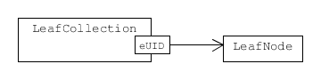

.. _serialisation:

======================================================
Some comments about serialisation of uncertain numbers
======================================================

.. contents::
   :local:

Overview
========
``GTC`` implements the method of evaluating measurement uncertainty described in the GUM [#GUM]_. This is idea is that a mathematical description of the measurand can be expressed as a function of the terms representing things that significantly influence the outcome of a measurement procedure. This is also called a measurement model (see :ref:`measurement_models`)

.. math::

    Y = f(X_1, X_2, \cdots) \;,
    
where the :math:`X_i` are influence quantities. 

A function for a particular measurement process at a laboratory is often used. However, this is not strictly correct. A traceable measurement is really a staged process that takes place over time and at different laboratories. Typically, national metrology institutes realise SI unit standards and then calibrate transfer standards for second-tier calibration laboratories. The second-tier laboratories in turn calibrate customer instruments, or other working standards, until the process finally ends with a measurement that is not passed further along the chain. 

The model function :math:`f(\cdots)` should really describe the whole traceability chain, starting with the realisation of physical unit references and ending at the current stage. In practice, no one does that yet; however, the serialisation processes provided by ``GTC`` implements the necessary data handling. 

With serialisation, it is possible to store details about results and their influences from one session and then restore those details at a later session, where calculations can continue with no loss of information.

This section of the ``GTC`` documentation describes the conceptual model we use to think about storing and retrieving uncertain numbers. The description does not depend on a particular format (like JSON or XML). We use UML diagrams to illustrate the model [#UML]_.

Reporting results
-----------------
The GUM explains that it is important to report the value of a measurement result together with information about its uncertainty. The best uncertainty information is the set of uncertainty components, which are defined as

.. math::

    u_i(y) = \left. \frac{\partial f}{\partial X_i} \right|_{X_i = x_i} \, u(x_i)\;,

where :math:`u(x_i)` is the standard uncertainty in :math:`x_i` as an estimate of :math:`X_i`, and :math:`u_i(y)` is the notation introduced in the GUM for the component of uncertainty in :math:`y` due to uncertainty in :math:`x_i`.
With a complete set of uncertainty components the standard uncertainty in :math:`y` as an estimate of :math:`Y` can be calculated.

The algorithms used in ``GTC`` for uncertainty propagation work with the uncertainty components associated with various uncertain numbers. So, serialisation must capture the uncertainty components of uncertain numbers.

.. _serialisation_elements:

Basic Structural Elements 
=========================
The :math:`X_i` terms in the measurement function refer to influence quantities; they are not precisely known. We may think of :math:`X_i = x_i - E_i`, with the known estimate :math:`x_i` and an unknown error in that estimate :math:`E_i`. We take a value of zero with :math:`E_i` (i.e., a perfect estimate: :math:`X_i = x_i`), but there is some uncertainty, :math:`u(x_i)`, in this choice, and there may also be a value for the degrees of freedom, :math:`\nu_i`.

When we supply values for :math:`x_i`, :math:`u(x_i)`, and :math:`\nu_i` (e.g., using :func:`~core.ureal`), we say an *elementary* uncertain number is created. The individual properties of elementary uncertain numbers do no depend on other uncertain numbers (they may be correlated with other elementary uncertain numbers, but that is a property of uncertain-numbers pairs). When an uncertain number object is created by a calculation involving other uncertain numbers we call it an *intermediate* uncertain number (e.g., by :func:`~core.result`). 

The goal of serialisation is to store enough detail about selected elementary and intermediate uncertain numbers so that they can be restored to a different Python session and used there without loss of information. The :class:`~persistence.Archive` class is used to marshal selected uncertain numbers and prepare them for storage, or to extract selected uncertain numbers after retrieval from storage. 

Basic types
-----------
To be clear about constraints on the data involved in serialisation, we start by defining some special basic data types.

The range of values that some of the primitive data types can take is constrained. Standard uncertainty (``Uncertainty``) is a real number that must be greater than or equal to zero.  Degrees of freedom (``DoF``) is a real number that must be greater than or equal to unity (and may be explicitly set to infinity). A correlation coefficient (``CorrelationCoef``) is a real number greater than or equal to -1 and less than or equal to 1. 

.. figure:: ../images/dm/special_primitives.png
    :align: center
    :alt: Constrained primitive data types
    
    Classes for degrees of freedom, standard uncertainty, and correlation coefficient.

The way we digitalise the subscripts appearing in GUM formulae is an important detail. GUM notation is intended for people familiar with mathematical notation. It is quite simple, but the innocent subscript :math:`i` must actually uniquely identify each object, no matter how many there are. So, for digitalisation we need identifiers that are unique: we use what is called a Universally Unique Identifier for this. Our serialisation has two identifier formats. One format is used for elementary uncertain numbers, the other for intermediate uncertain numbers. We call these identifiers ``eUID``, for elementary uncertain numbers, and ``iUID``, for intermediate uncertain numbers [#IDs]_. 

.. figure:: ../images/dm/IDs.png
    :align: center
    :alt: ID classes
    
    Unique identifier types for elementary and intermediate uncertain numbers

To represent data labelled by a subscript in formal notation, we use classes that pair an ID with a value. 

.. figure:: ../images/dm/id_reals.png
    :align: center
    :alt: Pairing of IDs with real values
    
    Pairing of unique identifiers for elementary and intermediate uncertain numbers with data.

A few more classes are associated with ``eUID``. 

    * ``Ensemble`` is a collection of elementary uncertain-number IDs that belong to the same ensemble (the type of collection may be considered a set, where order is not important and each element is unique).   

    .. figure:: ../images/dm/ensemble.png
        :align: center
        :alt: Ensemble class
        
        An ensemble is a set of elementary uncertain-number IDs. 
        
    * ``Correlation`` is a collection of elementary uncertain-number IDs that have been assigned correlation coefficients. 

    .. figure:: ../images/dm/correlation.png
        :align: center
        :alt: Correlation class
        
        A set of ``eCoefficient`` objects, which store information about correlation between elementary uncertain numbers. 
 
    * ``ComplexLeaf`` consists of a pair of ``eUID`` values. This is sufficient to reconstitute an elementary complex uncertain number.

    .. figure:: ../images/dm/complex_leaf.png
        :align: center
        :alt: ComplexLeaf class
        
        An elementary complex uncertain number is composed of a pair of elementary real uncertain numbers. 

Nodes
-----
We have adopted the term 'node' for an object that holds information about an uncertain number object. For example, a leaf node is related to an elementary uncertain number. 
  
The information required to restore an influence quantity is captured as attributes of ``LeafNode``. There are a number of optional attributes:

    * ``label`` may not have been assigned
    * ``complex`` is needed when the node is one component of an uncertain complex number.
    * `` correlation`` will be needed when correlation coefficients have been assigned (e.g., using :func:`~core.set_correlation`)
    * ``ensemble`` will be needed when the elementary uncertain number is part of an ensemble

.. figure:: ../images/dm/leaves.png
    :align: center
    :alt: LeafNode class
    
    The ``LeafNode`` holds all information needed about an influence quantity. 

A corresponding ``ComplexLeaf`` has attributes for identifiers of the elementary uncertain numbers representing the real and imaginary components

.. figure:: ../images/dm/complex_leaf.png
    :align: center
    :alt: LeafNode class
    
    The ``ComplexLeaf`` holds identifiers for the real and imaginary components. 

There is also an ``IntermediateNode`` that holds information about an intermediate result. This class holds similar information to the ``uid``, ``u``, and ``df`` attributes of ``LeafNode``. However, there is more information available about an intermediate result in another class called ``IntermediateReal``.

.. figure:: ../images/dm/intermediate_node.png
    :align: center
    :alt: IntermediateNode class
    
    The ``IntermediateNode`` holds information about an intermediate result. The attributes of this class are similar to attributes of ``LeafNode``. This information is is required to restore an intermediate uncertain number in a session but they are not needed for uncertainty propagation. 
    
Marshalling before serialisation 
--------------------------------
Uncertain numbers are selected and added to a collection before serialisation. The serialisation process then works on the accumulated set of objects. 

The complete set of influences (elementary uncertain numbers) must be identified. Individual influences may not have been added to the collection, but any information critical to restoring the selected uncertain numbers will be collected at thi stage. This results in a collection of ``LeafNode`` objects, with each element is identified by an ``eUID``. 

    
    An associative collection of leaf nodes accessed by the corresponding ``eUID``.   

When uncertain numbers are selected for storage they are tagged with a text label, to identify the object in the collection (the tag may bear no relation to an uncertain-number label, it is just used to extract the object from storage later). Collections of tagged uncertain real numbers are included in the serialised record. The elements of this collection may be one of two types: ``eReal`` (shown above), for elementary uncertain real numbers, or ``IntermediateReal``, for intermediate uncertain real numbers. We call this a ``RealsCollection``.

    
    An associative collection of details about tagged uncertain real numbers that can be accessed by the tag.   

Most of the information required to restore an elementary uncertain real number is held in a ``LeafNode``, so only the value of the uncertain real number is held in ``eReal``.
On the other hand, the information needed to restore an intermediate uncertain real number includes the set of uncertainty components. This is held in the `u_components` attribute of ``IntermediateReal`` [#components]_.

    
    A class to record details about tagged intermediate uncertain real numbers.   

To restore intermediate uncertain real numbers a collection of ``Intermediate Node`` objects is prepared. 

    
    An associative collection for tagged intermediate uncertain real numbers.   

 
When an uncertain complex numbers are selected for storage they are also tagged. A collection of tagged uncertain complex numbers is included in the serialised record, which consists of ``Complex`` objects
 
.. figure:: ../images/dm/complex.png
    :align: center
    :alt: Complex class
    
    An associative collection of details about tagged uncertain complex numbers. The ``Complex`` class holds the tags of uncertain real numbers corresponding to the real and imaginary components of a tagged uncertain complex number. 

Most of the information required to restore an uncertain complex number is held in the uncertain real number objects for its (real-valued) components. These objects are automatically added to another ``RealsCollection``, which is included in the serialised record (the tags in this collection are derived from the tag used initially for the uncertain complex number). Again, elements of this collection may be one of two types: ``eReal`` or ``IntermediateReal``.
    
.. rubric:: Footnotes
 
.. [#GUM]

    BIPM and IEC and IFCC and ISO and IUPAC and IUPAP and OIML, 
    *Evaluation of measurement data - Guide to the expression of uncertainty in measurement JCGM 100:2008 (GUM 1995 with minor corrections)*, (2008) `http://www.bipm.org/en/publications/guides/gum <http://www.iso.org/sites/JCGM/GUM/JCGM100/C045315e-html/C045315e.html?csnumber=50461>`_

 
.. [#UML] 

   Object Management Group, *Unified Modeling Language Specification (Version 2.5)*, (2015) https://www.omg.org/spec/UML/2.5

.. [#IDS]

    Identifier formats do not affect the conceptual description of serialisation. Integer tuples are the identifiers of uncertain-number objects. For elementary uncertain numbers, a 2-tuple is used: the first element is a UUID, in long integer format, obtained once for each session; the second element is an integer obtained from a counter which is incremented during the session. This format of identifier can be ordered. For intermediate uncertain numbers, the identifier is a 3-tuple, with the first two elements obtained as for elementary uncertain numbers and the last element is zero. The tuple length is used to distinguishes between elementary and intermediate identifiers, so first two elements of the identifiers may collide.
    
.. [#components]

    In practice, there is some benefit in separating the components of uncertainty into two distinct subsets, one of which has components with respect to influences that are correlated. There is also interest in recording what we call intermediate components of uncertainty, which relate to how much contribution an intermediate result makes to a subsequent result (for more details, see [#GTC2023]_).
    
.. [#GTC2023]

    B. D. Hall, *The GUM Tree Calculator: A Python Package for Measurement Modelling and Data Processing with Automatic Evaluation of Uncertainty*, Metrology 2022, 2(1), 128-149;
    https://doi.org/10.3390/metrology2010009 
